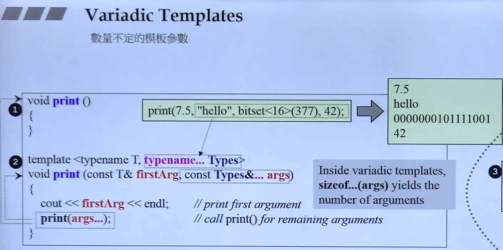

## 概述


## 1. 数量不定的模板参数



## 2. nullptr使0和NULL区分开

## 3. auto自动类型推导

## 4. 用{ }进行初始化


Initializer Lists<> 支持传递任意个数的参数


## 5. explicit


用于阻止构造函数自动调用

## 6. for遍历

底层实现：用迭代器


## 7. =default, =delete


## 8. noexcept、override、final

noexcept：用于使用move构造时强调不会抛出异常，让编译器放心使用。

override：用于标识子类想要重写的父类的虚函数

final：形容类时不能被继承，形容虚函数时不能被重写

## 9. decltype

- 声明返回类型


- 元编程


- 获取lambda的type


## 10. lambda

- lambda是一个函数对象，用于想临时写一个函数，本来应该在另一个地方重新定义函数再调用，现在直接在需要实现的地方写一个lambda作为一个inline函数


- []取外部参数，()传参数，mutable表示可以写，不加表示只读参数。


- 不写mutable不能++id


- 同等替换


- 用于STL容器的比较操作


## 11. Variadic Template 可变参数模板


- 模板中如果有特化和泛化产生歧义，优先调用特化

## 12. 右值引用

- 右值引用是一种新的引用类型，它可以用来减少不必要的拷贝（unnecessary copying），当赋值运算的右边是一个右值的话，那么左边的对象可以偷右边对象的资源。

  左值（L-Value）：**可以**出现在赋值运算符的左侧者；

  右值（R-Value）：**只能**出现在赋值运算符的右侧者；

  **临时对象**就是一种右值。右值不可以放在左边。


- copy是深拷贝，move是浅拷贝（要保证安全，用**偷**）
- 右值被引用/被move之后，原来的就不能再使用了


- 补充

1. **从性能上讲，左右值引用没有区别，传参使用左右值引用都可以避免拷贝。**
2. **右值引用可以直接指向右值，也可以通过std::move指向左值；而左值引用只能指向左值(const左值引用也能指向右值)。**
3. **作为函数形参时，右值引用更灵活。虽然const左值引用也可以做到左右值都接受，但它无法修改，有一定局限性。**

```cpp
void f(const int& n) {
    n += 1; // 编译失败，const左值引用不能修改指向变量
}

void f2(int && n) {
    n += 1; // ok
}

int main() {
    f(5);
    f2(5);
}
```

在实际场景中，右值引用和std::move被广泛用于在STL和自定义类中**实现移动语义，避免拷贝，从而提升程序性能**。

## 13. array，unordered

纯粹的定长数组

array定义：array<type, size> a; **定义时必须指定大小，不能扩容**


